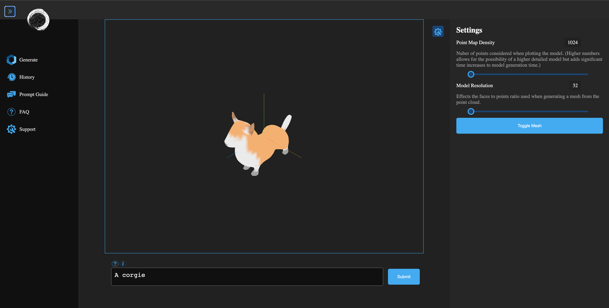

[
# GeneMesh: A Text To 3D Mesh Application
## Powered by OpenAI's POINT-E model

GeneMesh is an application designed to allow for more direct interaction between the user and OpenAI's POINT-E model.

## Features

* **Frontend:** An easy to use UI made with Javascript and the React framework that sends text promps to the backend to be turned into a 3D mesh. This mesh is then displayed using Three.js to eliminate the use of external 3d programs for viewing.
* **Backend:** A Python server made with Flask that recieves prompts from the frontend and then creates a 3D mesh using the POINT-E model.

## Installation
