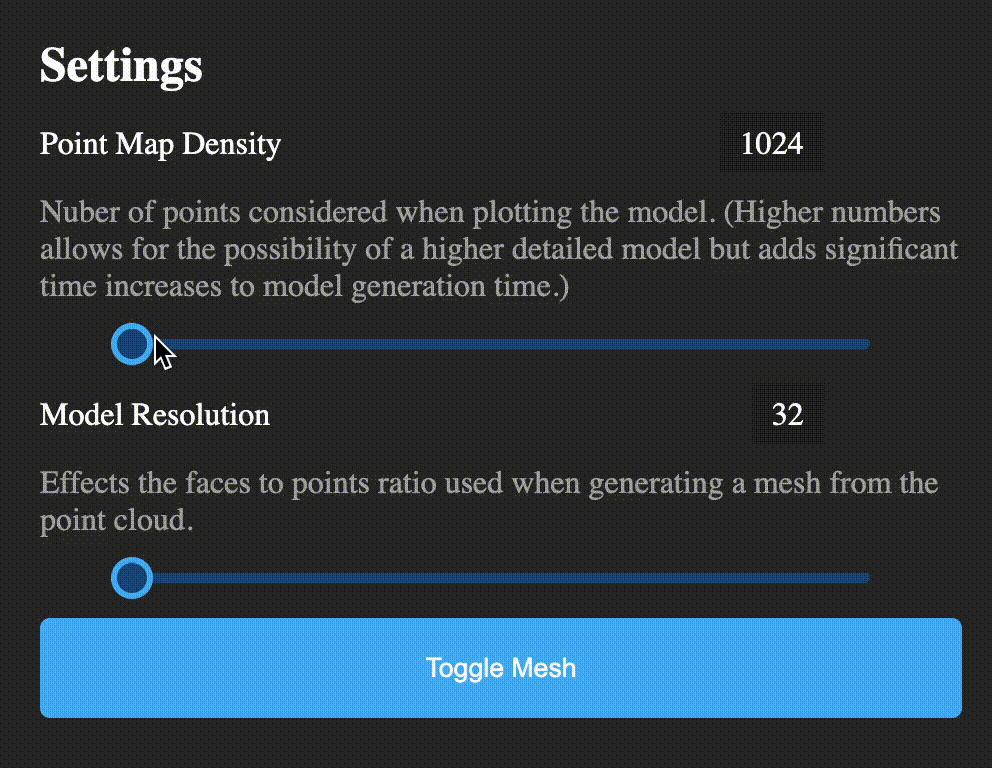
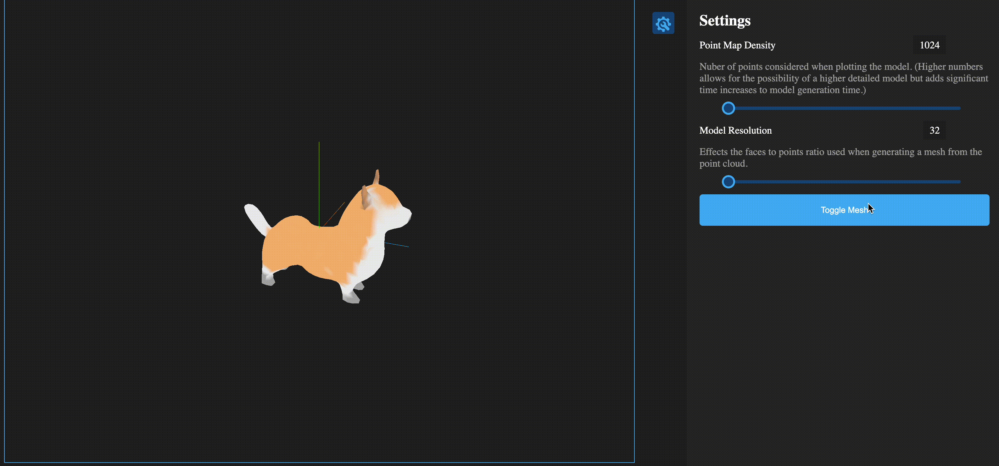

# GeneMesh: A Text To 3D Mesh Application
## Powered by OpenAI's POINT-E model

GeneMesh is an application designed to allow for more direct interaction between the user and OpenAI's POINT-E model.

## Tech Stack

* **Frontend:** An easy to use UI made with Javascript and the React framework that sends text promps to the backend to be turned into a 3D mesh. This mesh is then displayed using Three.js to eliminate the use of external 3d programs for viewing.
* **Backend:** A Python server made with Flask that recieves prompts from the frontend and then creates a 3D mesh using the POINT-E model.

## Features

* **Mesh Generation Settings:** Alter the point map density and mesh resolutions with custom scrollbars in the settings pannel.

* **Interactive 3D Model Viewer:** Inspect and interact with your model after it is created without the need to import it into another program.

* **Mesh Toggle:** Toggle between the mesh and point cloud for the model (currently working on adding the model wireframe to the toggle options as well).

## Important Notes
* **Generation Time:** Application testing took place on a 2022 macbook pro with M2 chip which on average took between 8 and 9 minutes to generate a complete 3D mesh.

* **Model Fidelity:** OpenAI's POINT-E model is in its infancy resulting in drastically different results between generations. Multiple attempts may be required to achieve a model that resembles the prompt or in some cases certain prompts may not produce satesfactory results at all due to the complexity or lack of reference models within the data set.

## Future plans
* **Model History:** Adding an interface to reference all models that have been generated in the past. This interface will also allow the user to delete unsatisfactory models so they are no longer stored.

* **Concurrent Generations:** Adding an option to the settings pannel to allow for the generation and display of multiple models based on the same prompt.